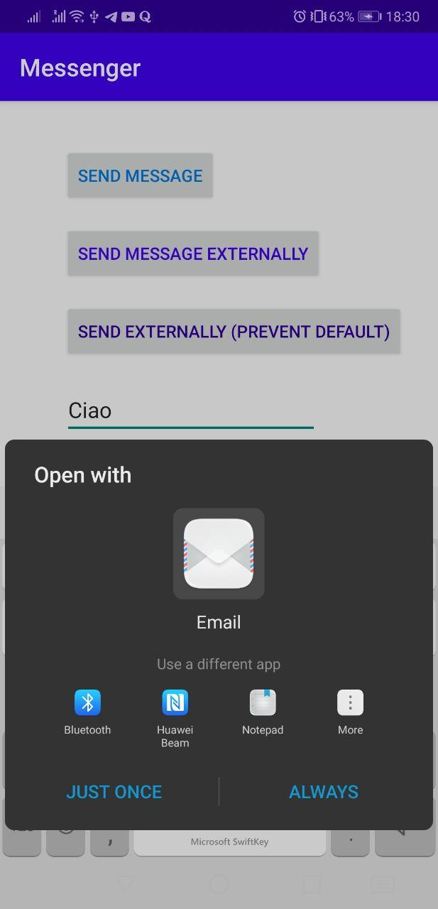
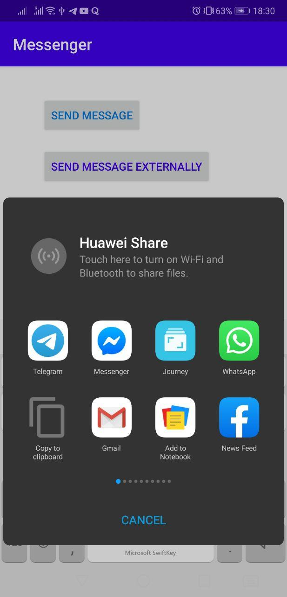

# App for Sending Messages
HFAD - Chapter 3

Demonstrate use of explicit (choose an activity within the app to perform an action) and implicit intents (allow the used to choose another app to perform the action).

Also, an implicit activity can either let the user choose an app, or trigger a choice every time.

Default choice:

Choose every time:
